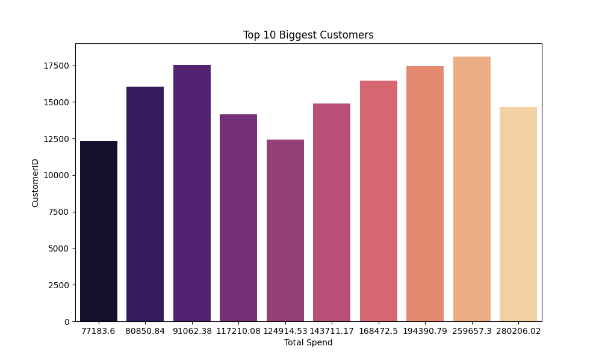

# 🛍️ E-commerce Analysis  

  

Comprehensive e-commerce sales analysis with **RFM segmentation**, visual insights, and customer profiling using Python.  

## 📌 Project Overview
This project analyzes retail transaction data to uncover sales trends, top products, key customers, geographic performance, and customer segmentation using **RFM (Recency, Frequency, Monetary)** analysis.  

The workflow includes:
- Data cleaning & preprocessing  
- Exploratory data analysis (EDA)  
- Visualization of sales insights  
- Customer segmentation for marketing strategies  

---

## 📂 Dataset
- **File:** `data.csv`  
- **Encoding:** `latin1` (ISO-8859-1)  
- **Columns:** `InvoiceNo`, `StockCode`, `Description`, `Quantity`, `InvoiceDate`, `UnitPrice`, `CustomerID`, `Country`  

---

## ⚙️ Steps Performed

``` python
# 1️⃣ Load dataset
df = pd.read_csv("data.csv", encoding='latin1')

# 2️⃣ Data cleaning
df.dropna(inplace=True)                    # Remove nulls
df.drop_duplicates(inplace=True)           # Remove duplicates
df = df[(df['Quantity'] > 0) & (df['UnitPrice'] > 0)]  # Remove invalid values

# 3️⃣ Feature engineering
df['InvoiceDate'] = pd.to_datetime(df['InvoiceDate'])
df['TotalPrice'] = df['Quantity'] * df['UnitPrice']
df['Year'] = df['InvoiceDate'].dt.year
df['Month'] = df['InvoiceDate'].dt.month
df['Week'] = df['InvoiceDate'].dt.isocalendar().week
df['Day'] = df['InvoiceDate'].dt.day

# 4️⃣ Exploratory Data Analysis (EDA)
# - Overall sales trend
# - Top 10 most sold products
# - Top 10 biggest customers
# - Sales by country

# 5️⃣ RFM Analysis
# Calculate Recency, Frequency, Monetary
# Assign RFM scores and segment customers
```
##  📊 Key Insights
## 1. Overall Sales Trend ##

- Shows fluctuations in daily sales. Useful for identifying seasonal peaks and slow periods.


## 2. Top 10 Most Sold Products ##

| Rank | Product Name    | Quantity Sold |
| ---- | --------------- | ------------- |
| 1    | LITTLE BIRDIE   | \~85,000      |
| 2    | TOP STORAGE JAR | \~70,000      |
| 3    | ASSTD DESIGNS   | \~50,000      |
| 4    | RED RETROSPOT   | \~35,000      |
| 5    | T-LIGHT HOLDER  | \~30,000      |
| 6    | BIRD ORNAMENT   | \~28,000      |
| 7    | TOP CAKE CASES  | \~25,000      |
| 8    | POPCORN HOLDER  | \~22,000      |
| 9    | NIGHT LIGHT     | \~20,000      |
| 10   | SET VINTAGE     | \~18,000      |


## 3. Top 10 Biggest Customers (by Spend) ##

| Rank | Customer ID | Total Spend |
| ---- | ----------- | ----------- |
| 1    | 9           | 280,206.02  |
| 2    | 8           | 259,657.30  |
| 3    | 7           | 194,390.79  |
| 4    | 6           | 168,475.20  |
| 5    | 5           | 143,711.17  |
| 6    | 4           | 129,414.53  |
| 7    | 3           | 117,210.08  |
| 8    | 2           | 91,062.38   |
| 9    | 1           | 80,850.84   |
| 10   | 0           | 77,183.60   |




## 4. Sales by Country ##

United Kingdom dominates sales (~£7M).

Other top markets: Netherlands, EIRE, Germany, France, Australia.

Most other countries contribute marginally.


## 5. Customer Segmentation (RFM Analysis) ##

| Segment            | Customers |
| ------------------ | --------- |
| Potential Loyalist | \~1,650   |
| Loyal Customer     | \~1,300   |
| At Risk            | \~1,300   |
| Lost               | Remaining |


# Definitions:

- Loyal Customer: High RFM score — frequent, recent, and high spenders.

- Potential Loyalist: Good frequency and spend, but slightly less recent.

- At Risk: Previously good customers, but haven’t purchased recently.

- Lost: Low engagement and spend.

  ## 📦 Libraries Used
``` python
import pandas as pd
import numpy as np
import matplotlib.pyplot as plt
import seaborn as sns
```

## 🚀 How to Run

1️⃣ Clone the repository:
```bash
git clone https://github.com/Muhiddin-28/e-commerce-analysis.git
cd e-commerce-analysis
```
2️⃣ Install dependencies:
```
pip install pandas numpy matplotlib seaborn
```
3️⃣Extract dataset
```
unzip data.zip
```
4️⃣ Run the analysis script:
```
python main.py
```
## 🎯 Business Value
- Identify best-selling products for inventory planning.

- Recognize high-value customers for loyalty programs.

- Target at-risk customers with re-engagement campaigns.

